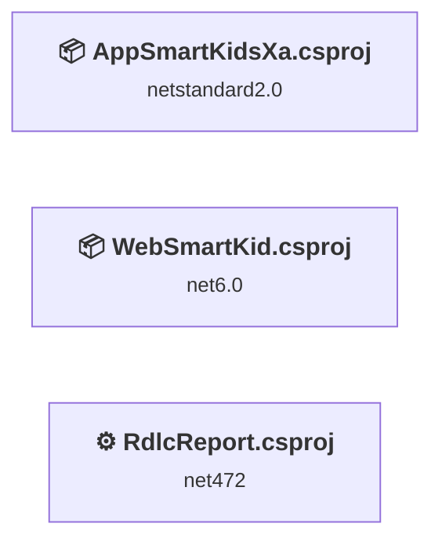
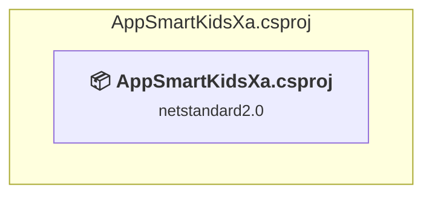
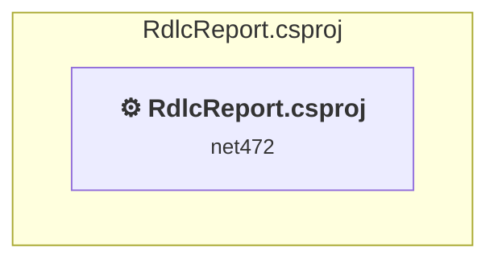
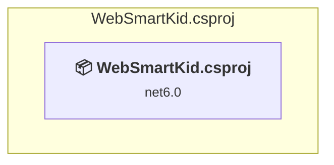

# Projects and dependencies analysis

This document provides a comprehensive overview of the projects and their dependencies in the context of upgrading to .NETCoreApp,Version=v10.0.

## Table of Contents

- [Executive Summary](#executive-Summary)
  - [Highlevel Metrics](#highlevel-metrics)
  - [Projects Compatibility](#projects-compatibility)
  - [Package Compatibility](#package-compatibility)
  - [API Compatibility](#api-compatibility)
- [Aggregate NuGet packages details](#aggregate-nuget-packages-details)
- [Top API Migration Challenges](#top-api-migration-challenges)
  - [Technologies and Features](#technologies-and-features)
  - [Most Frequent API Issues](#most-frequent-api-issues)
- [Projects Relationship Graph](#projects-relationship-graph)
- [Project Details](#project-details)

  - [AppSmartKidsXa\AppSmartKidsXa\AppSmartKidsXa.csproj](#appsmartkidsxaappsmartkidsxaappsmartkidsxacsproj)
  - [RdlcReport\RdlcReport.csproj](#rdlcreportrdlcreportcsproj)
  - [WebSmartKid\WebSmartKid.csproj](#websmartkidwebsmartkidcsproj)

## Executive Summary

### Highlevel Metrics

| Metric | Count | Status |
| :--- | :---: | :--- |
| Total Projects | 3 | All require upgrade |
| Total NuGet Packages | 20 | 11 need upgrade |
| Total Code Files | 170 |  |
| Total Code Files with Incidents | 9 |  |
| Total Lines of Code | 14551 |  |
| Total Number of Issues | 73 |  |
| Estimated LOC to modify | 51+ | at least 0.4% of codebase |

### Projects Compatibility

| Project | Target Framework | Difficulty | Package Issues | API Issues | Est. LOC Impact | Description |
| :--- | :---: | :---: | :---: | :---: | :---: | :--- |
| [AppSmartKidsXa\AppSmartKidsXa\AppSmartKidsXa.csproj](#appsmartkidsxaappsmartkidsxaappsmartkidsxacsproj) | netstandard2.0 | 🟢 Low | 5 | 33 | 33+ | ClassLibrary, Sdk Style = True |
| [RdlcReport\RdlcReport.csproj](#rdlcreportrdlcreportcsproj) | net472 | 🟢 Low | 0 | 4 | 4+ | ClassicWinForms, Sdk Style = False |
| [WebSmartKid\WebSmartKid.csproj](#websmartkidwebsmartkidcsproj) | net6.0 | 🟢 Low | 14 | 14 | 14+ | AspNetCore, Sdk Style = True |

### Package Compatibility

| Status | Count | Percentage |
| :--- | :---: | :---: |
| ✅ Compatible | 9 | 45.0% |
| ⚠️ Incompatible | 1 | 5.0% |
| 🔄 Upgrade Recommended | 10 | 50.0% |
| ***Total NuGet Packages*** | ***20*** | ***100%*** |

### API Compatibility

| Category | Count | Impact |
| :--- | :---: | :--- |
| 🔴 Binary Incompatible | 4 | High - Require code changes |
| 🟡 Source Incompatible | 14 | Medium - Needs re-compilation and potential conflicting API error fixing |
| 🔵 Behavioral change | 33 | Low - Behavioral changes that may require testing at runtime |
| ✅ Compatible | 14103 |  |
| ***Total APIs Analyzed*** | ***14154*** |  |

## Aggregate NuGet packages details

| Package | Current Version | Suggested Version | Projects | Description |
| :--- | :---: | :---: | :--- | :--- |
| Acr.UserDialogs | 7.2.0.564 |  | [AppSmartKidsXa.csproj](#appsmartkidsxaappsmartkidsxaappsmartkidsxacsproj) | ✅Compatible |
| AspNetCore.Reporting | 2.1.0 |  | [WebSmartKid.csproj](#websmartkidwebsmartkidcsproj) | ✅Compatible |
| Dapper | 2.0.123 |  | [WebSmartKid.csproj](#websmartkidwebsmartkidcsproj) | ✅Compatible |
| dcsoup | 1.0.0 |  | [AppSmartKidsXa.csproj](#appsmartkidsxaappsmartkidsxaappsmartkidsxacsproj) | ✅Compatible |
| Microsoft.AspNetCore.Authentication.JwtBearer | 5.0.12 | 10.0.2 | [WebSmartKid.csproj](#websmartkidwebsmartkidcsproj) | NuGet package upgrade is recommended |
| Microsoft.AspNetCore.SignalR.Client | 6.0.9 | 10.0.2 | [AppSmartKidsXa.csproj](#appsmartkidsxaappsmartkidsxaappsmartkidsxacsproj) | NuGet package upgrade is recommended |
| Microsoft.EntityFrameworkCore | 5.0.13 | 10.0.2 | [WebSmartKid.csproj](#websmartkidwebsmartkidcsproj) | NuGet package upgrade is recommended |
| Microsoft.EntityFrameworkCore.SqlServer | 5.0.12 | 10.0.2 | [WebSmartKid.csproj](#websmartkidwebsmartkidcsproj) | NuGet package upgrade is recommended |
| Microsoft.EntityFrameworkCore.Tools | 5.0.13 | 10.0.2 | [WebSmartKid.csproj](#websmartkidwebsmartkidcsproj) | NuGet package upgrade is recommended |
| Microsoft.VisualStudio.Web.CodeGeneration.Design | 6.0.9 | 10.0.2 | [WebSmartKid.csproj](#websmartkidwebsmartkidcsproj) | NuGet package upgrade is recommended |
| NETStandard.Library | 2.0.3 |  | [AppSmartKidsXa.csproj](#appsmartkidsxaappsmartkidsxaappsmartkidsxacsproj) | ✅Compatible |
| Newtonsoft.Json | 13.0.1 | 13.0.4 | [AppSmartKidsXa.csproj](#appsmartkidsxaappsmartkidsxaappsmartkidsxacsproj) [WebSmartKid.csproj](#websmartkidwebsmartkidcsproj) | NuGet package upgrade is recommended |
| OneSignalApi | 1.0.1 |  | [WebSmartKid.csproj](#websmartkidwebsmartkidcsproj) | ✅Compatible |
| OneSignalSDK.Xamarin | 4.3.5 |  | [AppSmartKidsXa.csproj](#appsmartkidsxaappsmartkidsxaappsmartkidsxacsproj) | ✅Compatible |
| Plugin.Share | 7.1.1 |  | [AppSmartKidsXa.csproj](#appsmartkidsxaappsmartkidsxaappsmartkidsxacsproj) | ⚠️NuGet package is deprecated |
| System.CodeDom | 6.0.0 | 10.0.2 | [WebSmartKid.csproj](#websmartkidwebsmartkidcsproj) | NuGet package upgrade is recommended |
| System.Data.SqlClient | 4.8.3 | 4.9.0 | [WebSmartKid.csproj](#websmartkidwebsmartkidcsproj) | NuGet package contains security vulnerability |
| System.IdentityModel.Tokens.Jwt | 6.12.2 | 8.15.0 | [WebSmartKid.csproj](#websmartkidwebsmartkidcsproj) | NuGet package contains security vulnerability |
| Xamarin.Essentials | 1.7.0 |  | [AppSmartKidsXa.csproj](#appsmartkidsxaappsmartkidsxaappsmartkidsxacsproj) | NuGet package functionality is included with framework reference |
| Xamarin.Forms | 5.0.0.2196 |  | [AppSmartKidsXa.csproj](#appsmartkidsxaappsmartkidsxaappsmartkidsxacsproj) | NuGet package functionality is included with framework reference |

## Top API Migration Challenges

### Technologies and Features

| Technology | Issues | Percentage | Migration Path |
| :--- | :---: | :---: | :--- |
| IdentityModel & Claims-based Security | 4 | 7.8% | Windows Identity Foundation (WIF), SAML, and claims-based authentication APIs that have been replaced by modern identity libraries. WIF was the original identity framework for .NET Framework. Migrate to Microsoft.IdentityModel.* packages (modern identity stack). |
| Legacy Configuration System | 2 | 3.9% | Legacy XML-based configuration system (app.config/web.config) that has been replaced by a more flexible configuration model in .NET Core. The old system was rigid and XML-based. Migrate to Microsoft.Extensions.Configuration with JSON/environment variables; use System.Configuration.ConfigurationManager NuGet package as interim bridge if needed. |

### Most Frequent API Issues

| API | Count | Percentage | Category |
| :--- | :---: | :---: | :--- |
| T:System.Uri | 16 | 31.4% | Behavioral Change |
| T:System.Net.Http.HttpContent | 8 | 15.7% | Behavioral Change |
| M:System.Uri.#ctor(System.String) | 8 | 15.7% | Behavioral Change |
| M:System.Data.DataSet.#ctor(System.Runtime.Serialization.SerializationInfo,System.Runtime.Serialization.StreamingContext,System.Boolean) | 2 | 3.9% | Source Incompatible |
| M:System.TimeSpan.FromSeconds(System.Double) | 1 | 2.0% | Source Incompatible |
| M:System.Configuration.ApplicationSettingsBase.#ctor | 1 | 2.0% | Source Incompatible |
| T:System.Configuration.ApplicationSettingsBase | 1 | 2.0% | Source Incompatible |
| M:System.IdentityModel.Tokens.Jwt.JwtSecurityTokenHandler.WriteToken(Microsoft.IdentityModel.Tokens.SecurityToken) | 1 | 2.0% | Binary Incompatible |
| M:System.IdentityModel.Tokens.Jwt.JwtSecurityTokenHandler.CreateToken(Microsoft.IdentityModel.Tokens.SecurityTokenDescriptor) | 1 | 2.0% | Binary Incompatible |
| T:System.IdentityModel.Tokens.Jwt.JwtSecurityTokenHandler | 1 | 2.0% | Binary Incompatible |
| M:System.IdentityModel.Tokens.Jwt.JwtSecurityTokenHandler.#ctor | 1 | 2.0% | Binary Incompatible |
| M:Microsoft.AspNetCore.Builder.ExceptionHandlerExtensions.UseExceptionHandler(Microsoft.AspNetCore.Builder.IApplicationBuilder,System.String) | 1 | 2.0% | Behavioral Change |
| M:System.TimeSpan.FromDays(System.Double) | 1 | 2.0% | Source Incompatible |
| M:System.TimeSpan.FromHours(System.Double) | 1 | 2.0% | Source Incompatible |
| P:Microsoft.AspNetCore.Authentication.JwtBearer.JwtBearerOptions.TokenValidationParameters | 1 | 2.0% | Source Incompatible |
| P:Microsoft.AspNetCore.Authentication.JwtBearer.JwtBearerOptions.RequireHttpsMetadata | 1 | 2.0% | Source Incompatible |
| P:Microsoft.AspNetCore.Authentication.JwtBearer.JwtBearerOptions.SaveToken | 1 | 2.0% | Source Incompatible |
| T:Microsoft.AspNetCore.Authentication.JwtBearer.JwtBearerDefaults | 1 | 2.0% | Source Incompatible |
| F:Microsoft.AspNetCore.Authentication.JwtBearer.JwtBearerDefaults.AuthenticationScheme | 1 | 2.0% | Source Incompatible |
| T:Microsoft.Extensions.DependencyInjection.JwtBearerExtensions | 1 | 2.0% | Source Incompatible |
| M:Microsoft.Extensions.DependencyInjection.JwtBearerExtensions.AddJwtBearer(Microsoft.AspNetCore.Authentication.AuthenticationBuilder,System.Action{Microsoft.AspNetCore.Authentication.JwtBearer.JwtBearerOptions}) | 1 | 2.0% | Source Incompatible |

## Projects Relationship Graph

Legend:
📦 SDK-style project
⚙️ Classic project

## Project Details

### AppSmartKidsXa\AppSmartKidsXa\AppSmartKidsXa.csproj

#### Project Info

- **Current Target Framework:** netstandard2.0✅
- **SDK-style**: True
- **Project Kind:** ClassLibrary
- **Dependencies**: 0
- **Dependants**: 0
- **Number of Files**: 69
- **Number of Files with Incidents**: 3
- **Lines of Code**: 4051
- **Estimated LOC to modify**: 33+ (at least 0.8% of the project)

#### Dependency Graph

Legend:
📦 SDK-style project
⚙️ Classic project

### API Compatibility

| Category | Count | Impact |
| :--- | :---: | :--- |
| 🔴 Binary Incompatible | 0 | High - Require code changes |
| 🟡 Source Incompatible | 1 | Medium - Needs re-compilation and potential conflicting API error fixing |
| 🔵 Behavioral change | 32 | Low - Behavioral changes that may require testing at runtime |
| ✅ Compatible | 4401 |  |
| ***Total APIs Analyzed*** | ***4434*** |  |

### RdlcReport\RdlcReport.csproj

#### Project Info

- **Current Target Framework:** net472
- **Proposed Target Framework:** net10.0-windows
- **SDK-style**: False
- **Project Kind:** ClassicWinForms
- **Dependencies**: 0
- **Dependants**: 0
- **Number of Files**: 6
- **Number of Files with Incidents**: 3
- **Lines of Code**: 1284
- **Estimated LOC to modify**: 4+ (at least 0.3% of the project)

#### Dependency Graph

Legend:
📦 SDK-style project
⚙️ Classic project

### API Compatibility

| Category | Count | Impact |
| :--- | :---: | :--- |
| 🔴 Binary Incompatible | 0 | High - Require code changes |
| 🟡 Source Incompatible | 4 | Medium - Needs re-compilation and potential conflicting API error fixing |
| 🔵 Behavioral change | 0 | Low - Behavioral changes that may require testing at runtime |
| ✅ Compatible | 444 |  |
| ***Total APIs Analyzed*** | ***448*** |  |

#### Project Technologies and Features

| Technology | Issues | Percentage | Migration Path |
| :--- | :---: | :---: | :--- |
| Legacy Configuration System | 2 | 50.0% | Legacy XML-based configuration system (app.config/web.config) that has been replaced by a more flexible configuration model in .NET Core. The old system was rigid and XML-based. Migrate to Microsoft.Extensions.Configuration with JSON/environment variables; use System.Configuration.ConfigurationManager NuGet package as interim bridge if needed. |

### WebSmartKid\WebSmartKid.csproj

#### Project Info

- **Current Target Framework:** net6.0
- **Proposed Target Framework:** net10.0
- **SDK-style**: True
- **Project Kind:** AspNetCore
- **Dependencies**: 0
- **Dependants**: 0
- **Number of Files**: 133
- **Number of Files with Incidents**: 3
- **Lines of Code**: 9216
- **Estimated LOC to modify**: 14+ (at least 0.2% of the project)

#### Dependency Graph

Legend:
📦 SDK-style project
⚙️ Classic project

### API Compatibility

| Category | Count | Impact |
| :--- | :---: | :--- |
| 🔴 Binary Incompatible | 4 | High - Require code changes |
| 🟡 Source Incompatible | 9 | Medium - Needs re-compilation and potential conflicting API error fixing |
| 🔵 Behavioral change | 1 | Low - Behavioral changes that may require testing at runtime |
| ✅ Compatible | 9258 |  |
| ***Total APIs Analyzed*** | ***9272*** |  |

#### Project Technologies and Features

| Technology | Issues | Percentage | Migration Path |
| :--- | :---: | :---: | :--- |
| IdentityModel & Claims-based Security | 4 | 28.6% | Windows Identity Foundation (WIF), SAML, and claims-based authentication APIs that have been replaced by modern identity libraries. WIF was the original identity framework for .NET Framework. Migrate to Microsoft.IdentityModel.* packages (modern identity stack). |

